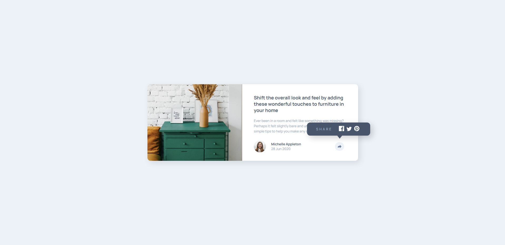

# Frontend Mentor - Article preview component solution

This is a solution to the [Article preview component challenge on Frontend Mentor](https://www.frontendmentor.io/challenges/article-preview-component-dYBN_pYFT). Frontend Mentor challenges help you improve your coding skills by building realistic projects.

## Table of contents

- [Overview](#overview)
  - [The challenge](#the-challenge)
  - [Screenshot](#screenshot)
  - [Links](#links)
- [My process](#my-process)
  - [Built with](#built-with)
  - [What I learned](#what-i-learned)
  - [Useful resources](#useful-resources)
- [Author](#author)

## Overview

### The challenge

Users should be able to:

- View the optimal layout for the component depending on their device's screen size
- See the social media share links when they click the share icon

### Screenshot

### Links

- Live Site URL: https://article-preview-component-six-gilt.vercel.app/

## My process

### Built with

- HTML5
- CSS
- Flexbox
- JavaScript
- Mobile-first workflow

### What I learned

In this project, I learned how to use the resize event listener to change the display values of an element. This was helpful to hide the share container if it was already opened when switching to desktop or mobile view. I also practiced how to manipulate elements using JavaScript.

### Useful resources

- [Clip-path](https://css-tricks.com/almanac/properties/c/clip-path/) - This helped me create shapes which was used for the share container popup in the desktop view.

## Author

- Frontend Mentor - [@JacksonJ97](https://www.frontendmentor.io/profile/JacksonJ97)
