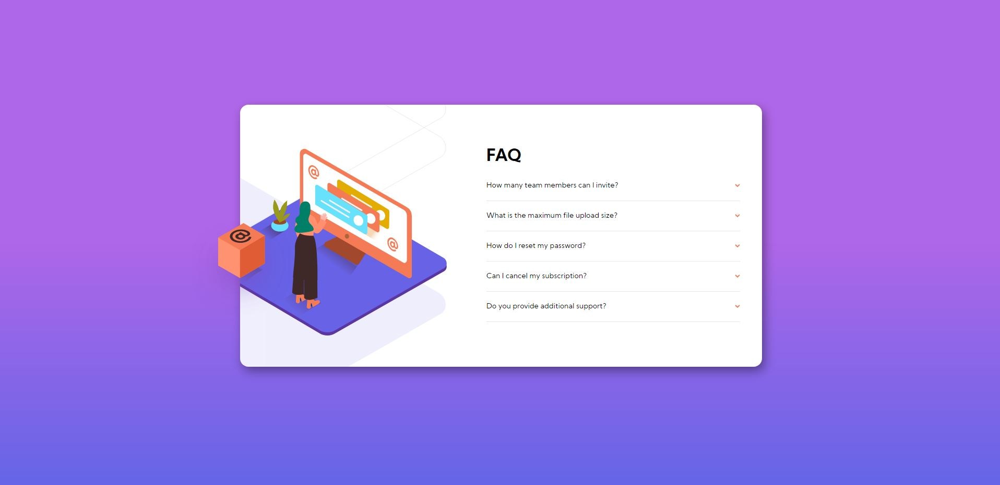
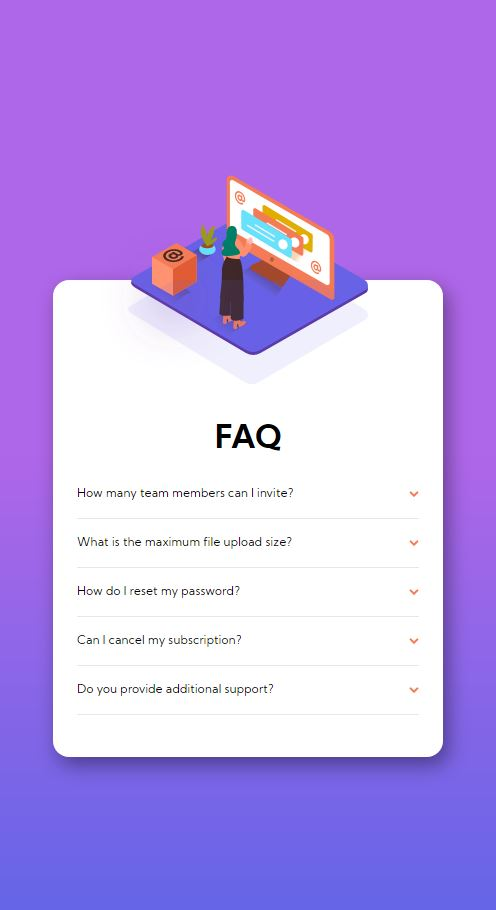
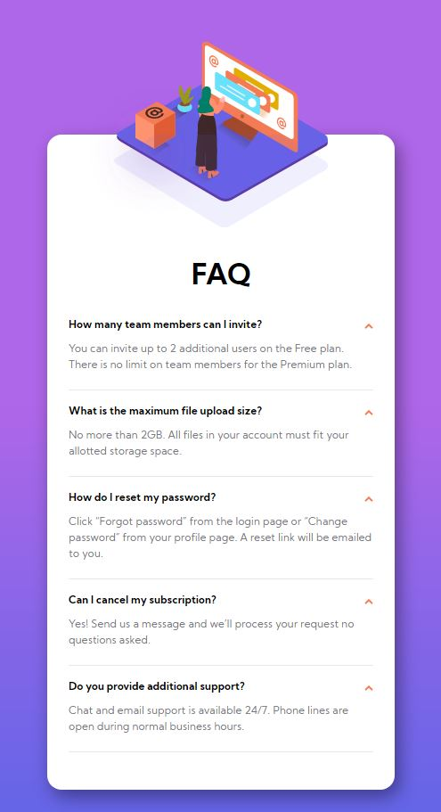

# Frontend Mentor - FAQ accordion card solution

This is a solution to the [FAQ accordion card challenge on Frontend Mentor](https://www.frontendmentor.io/challenges/faq-accordion-card-XlyjD0Oam). Frontend Mentor challenges help you improve your coding skills by building realistic projects.

## Table of contents

- [Overview](#overview)
  - [The challenge](#the-challenge)
  - [Screenshot](#screenshot)
  - [Links](#links)
- [My process](#my-process)
  - [Built with](#built-with)
  - [What I learned](#what-i-learned)
- [Author](#author)

## Overview

### The challenge

Users should be able to:

- View the optimal layout for the component depending on their device's screen size
- See hover states for all interactive elements on the page
- Hide/Show the answer to a question when the question is clicked

### Screenshot

### Links

- Live Site URL: https://faq-accordion-card-sable.vercel.app/

## My process

### Built with

- HTML5
- CSS
- JavaScript
- Flexbox
- Mobile-first workflow

### What I learned

In this project, I practiced DOM manipulation to hide/show an accordion panel. I used JavaScript to select the elements that were going to change when the click event on the accordion is fired. When the click event was fired, certain classes were toggled depending on if the panel was opened or closed. I also practiced positioning elements in CSS which was needed to piece together the mobile and desktop illustration.

## Author

- Frontend Mentor - [@JacksonJ97](https://www.frontendmentor.io/profile/JacksonJ97)
