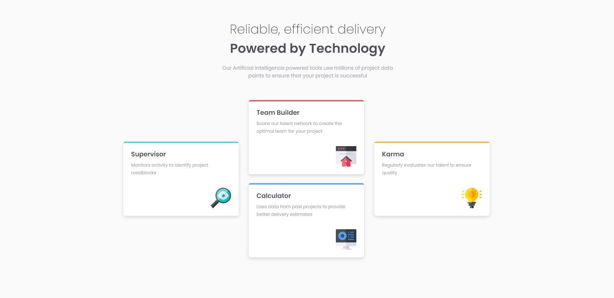
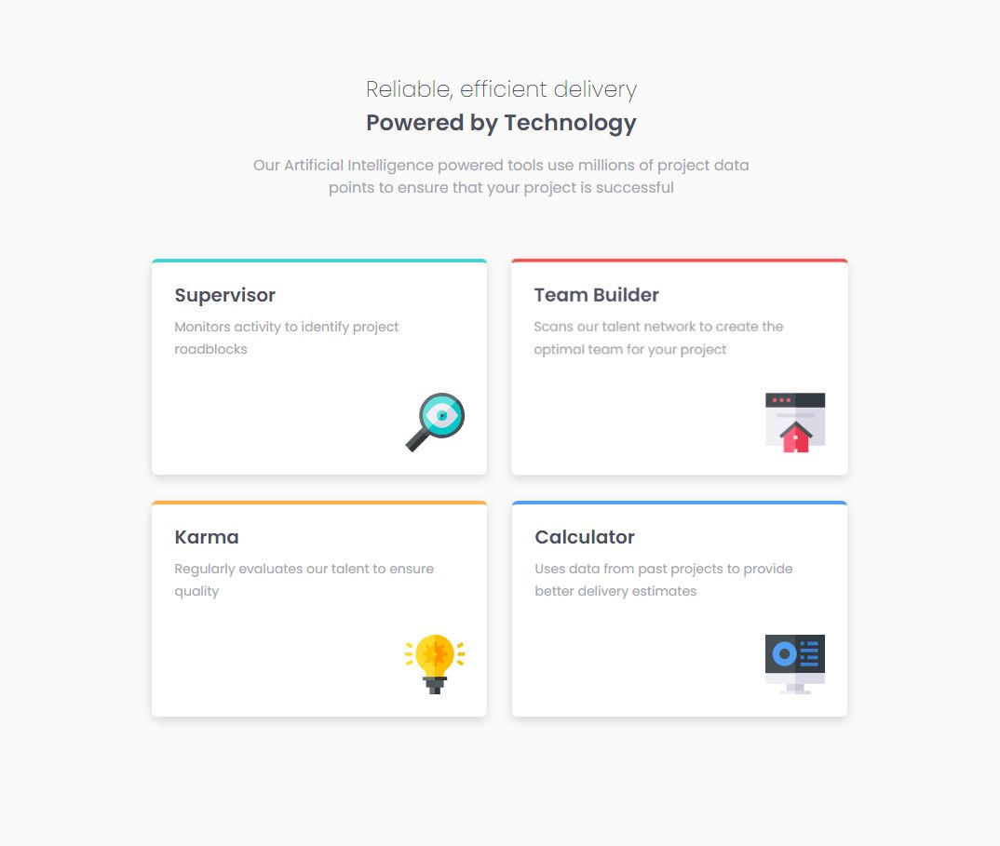
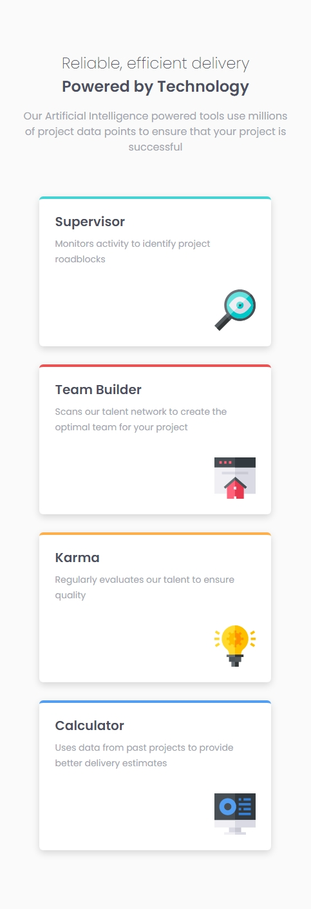

# Frontend Mentor - Four card feature section solution

This is a solution to the [Four card feature section challenge on Frontend Mentor](https://www.frontendmentor.io/challenges/four-card-feature-section-weK1eFYK).

## Table of contents

- [Overview](#overview)
  - [The challenge](#the-challenge)
  - [Screenshot](#screenshot)
- [My process](#my-process)
  - [Built with](#built-with)
  - [What I learned](#what-i-learned)
- [Author](#author)

## Overview

### The challenge

Users should be able to:

- View the optimal layout for the site depending on their device's screen size

### Screenshot

## My process

### Built with

- HTML5
- CSS
- Flexbox
- CSS Grid
- CSS Animations
- Mobile-first workflow

### What I learned

In this project, I practiced structuring a website using HTML, styling elements using CSS, and laying out the elements using Flexbox & CSS Grid. This project also served as practice for responsive web design. I learned and used CSS animations to make the cards feel more alive when you hover over them.

## Author

- Frontend Mentor - [@JacksonJ97](https://www.frontendmentor.io/profile/JacksonJ97)
